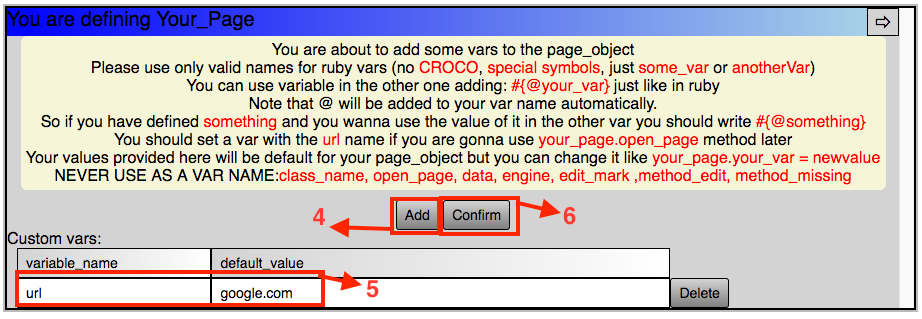
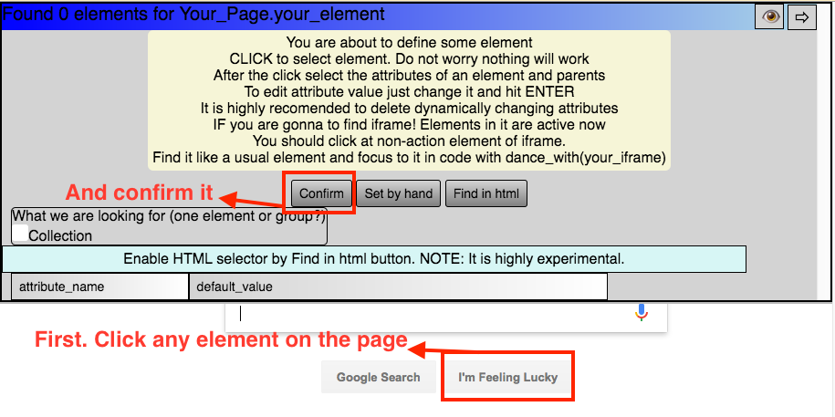
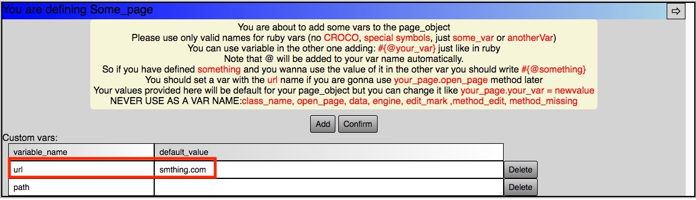
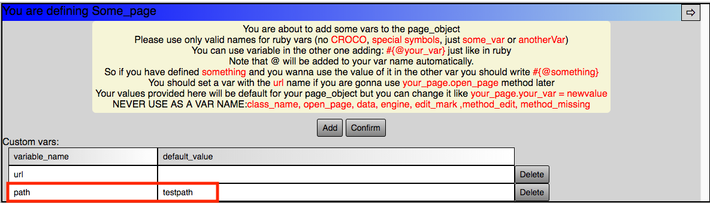
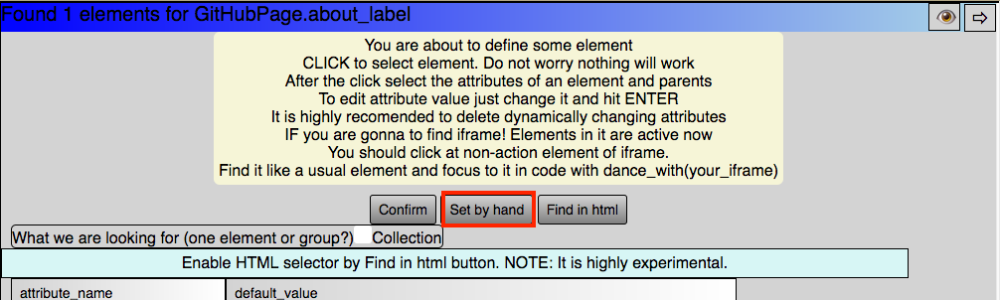
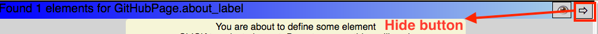
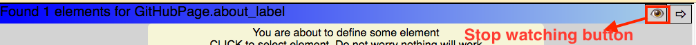

# Marta

Marta was planned as an element locating tool for Watir tests. But now Marta is also a pretty new way to write selenium tests for WEB applications using Watir. Main idea is very similar to cucumber. In Cucumber you are writing test and then defining a code behind it. In Marta you are writing code and then defining classes/pageobjects and methods/elements behind it thru your browser window.

Also Marta is providing a little more stability when locating elements on the page.

## Refactoring notification.

Version 0.41245 (that one) is the version with new structure of data storing. Marta will try to convert old pajeobject json files to the new format automatically. But manual redefining is the safest way.

## Installation

Add this line to your application's Gemfile:

```ruby
gem 'marta'
```

And then execute:

    $ bundle

Or install it yourself as:

    $ gem install marta

## Usage

1. Be sure that you have [Chromedriver](https://sites.google.com/a/chromium.org/chromedriver/) installed as well as [Chrome browser](https://www.google.com/chrome/browser/desktop/). It should work with any browser but it's definitely working in Chrome :)
2. Write the code
```ruby
require 'marta'
include Marta
dance_with
your_page = Your_Page.new
your_page.open_page
your_page.your_element.click
```
3. Run it in terminal with parameter LEARN=1 approximately like:

    $ LEARN=1 ruby path_to_your_test.rb

4. Take a look at the browser window: Marta will ask you to define Your_Page class. You can add variables for the class there.
5. Add *url* variable with the url of desired page as a default value.
6. Confirm.



7. Then page will be opened and you will be asked about your_element.
8. Just click the element and confirm the selection.



9. Now you can run the test without LEARN parameter and it will work.

**So you are `writing code in pageobject pattern` style.**

**Where each `class is` meant to be a `pageobject`.**

**Where each `method` except reserved (method_edit, engine, open_page, new, class, etc.) `can be a class variable or` should represent `an element at the page`.**

**At first `run` (with `learning mode enabled`) you are `defining Pages and elements` via web interface.**

**After that you can `run your code without learning` and it should pass.**

**`Stability` of the scheme `is ensured by` Marta's `ability to find elements` even `if` some `attributes were changed`.**

## FAQ
**Q: What if some attributes of elements will be changed?**

*A: First of all at the defining stage you can exclude dynamic attributes. Also Marta has special Black Magic algorithm that will try to find the most similar element anyway.*

*NOTE: Exclude attributes with empty values as well. In later versions Marta will filter them out automatically.*

**Q: What if I can locate element only by dynamic attributes like account_id?**

*A: For example you've got an element:*

```html
<span account_id="(notimportantpart)_2132">Account</span>
```

*where 2132 is a dynamic value that is not known at the begining of the test.*

*First at the stage of page defining create a class variable account_id = "anything".*


*After that you can dynamically change it in your code like*
```ruby
your_page.account_id # will be "anything" by default
your_page.account_id = "2132"
```
*At the stage of element defining you should be sure that your_page.account_id has your right value, just the same as in account_id attribute of your span. Just click on your span and Marta will remember that attribute automatically as an attribute with a dynamic part. Next time it will automatically change dynamic part of an attribute to your_page.account_id value.*

*If there are two dynamic attributes that are containing the same dynamic part. Like:*
```html
<span account_id="(notimportantpart)_2132" value="2132">Account</span>
```
*You can use variable with name containing both. Like:*
```ruby
your_page.account_id_and_value #=> whatever was set by default at the page defining stage.
your_page.account_id_and_value = "2132"
```
*Marta will understand it.*

*You can see an example of it in exapmle_project. Page variable id_and_value_for_radio is related to attributes id and value of the radio buttons*

**Q: I want to turn learning mode on\off in the code. How?**

*A:*
```ruby
dance_with learn: true or false
```
*Note: it may not work inside of the previously defined class. In that case use:*
```ruby
your_page.method_edit('newelementname')
```

**Q: I want to use firefox. How could I?**

*A: dance_with is accepting parameter :browser like*
```ruby
dance_with browser: Watir::Browser.new(:firefox)
```
*Note: If you are using a custom browser learn mode will not work properly. Custom browsers could be used for execution only*

**Q: Why firefox(or other browser) cannot be used for learning?**

*A: Marta is starting by default with Chrome with an extension - marta_app. It is for Chrome only. This app is used for dialogs between user and Marta in a learning mode as well as a server.*

**Q: A server?**

*A: In order to pass security restrictions for js on pages the code injected to the page by marta is sending information to the marta_app. And marta_app is sending information through a web server. You can force Marta to use a specific port:*
```ruby
dance_with port: 7766
```
*Note: default port is 6260 but now Marta is starting server for each thread. It will be changed in the future. So if the port 6260 is busy, Marta will take next 6261 and then 6262, etc.*

**Q: What else Marta server and Marta_app can do?**

*A: Nothing. But I have a nice plan about it.*

**Q: How Marta stores data?**

*A: Marta creates a json files in the default folder with name = Marta_s_pageobjects'. You can force Marta to use other folder like*
```ruby
dance_with folder: 'path/to/your/folder'
```

**Q: How is working the open_page method?**

*A: That method is a part of the SmartPage class. It means that you can call it for any class\page object which was generated by Marta. There are three ways to use it:*

*The most straight way:*
```ruby
dance_with
TestPage.open_page("smthing.com") # Will navigate you to http://smthing.com
```

*Predefined url way:*

*At the step of the page defining set variable url = smthing.com*

*And in the code:*
```ruby
dance_with
test_page = TestPage.open_page # Will navigate you to http://smthing.com
test_page.url #=> "smthing.com"
```

*The most flexible way:*

*At the step of the page defining you set path = testpath*

*And in the code:*
```ruby
dance_with base_url: "smthing.com"
test_page = TestPage.open_page # Navigating you to http://smthing.com/testpath
test_page.path #=> "testpath"
# You can open page once again using already created instance
test_page.open_page # Will navigate you to http://smthing.com/testpath too
```
*Note: If there is no path provided than Marta will go to base_url. Also if url value is defined for page Marta will use it instead the base_url. If url is given as argument for the open_page method Marta will ignore both url and base_url values and will use the argument provided.*

**Q: And what if I want to create page and define element without learn mode? For example in the middle of a debug session.**

*A Code in learn mode =*
```ruby
test_page = TestPage.new # Will show page creation dialog
test_page.magic_button # Will show magic_button locating dialog
```
*is totally identical to code without learn mode =*
```ruby
test_page = SmartPage.new("TestPage")
test_page.method_edit("magic_button")
```

**Q: Sometimes Marta is looking for the lost element for too long. What can I do about it?**

*A: You can set tolerancy parameter. Larger = longer*
```ruby
dance_with tolerancy: 10000# is the default value
```
*The amount = 10000 means that Marta will look for element 3 times (with different settings) trying up to 10000 xpaths each iteration. She will generate all possible combinations at first. When she's getting closer to the limit she's starting to try more random xpaths*

**Q: Marta is trying to find the lost element after pretty long time. Why?**

*A: Marta is not starting active search for the element immediately because she hopes that the element will appear (created by js). By default marta is waiting for the element for 10 seconds. But if you are sure that it is too long (or maybe too short) you can change that waiting time like:*
```ruby
dance_with cold_timeout: 5
```

**Q: What if I need Marta to drop all the settings to default?**

*A: Start Marta with clear setting*
```ruby
dance_with clear: true
```
*Note: It will restart browser as well*

**Q: How can I get Watir browser instance if I want for example execute_script or find element without Marta?**

*A: Like that*
```ruby
engine.execute_script('your script')
#or
your_page.engine.execute_script('your script')
#and
engine.element(id: 'will_be_located_without_Marta')
```

**Q: How can I find a collection of elements?**

*A: When defining an element you can set a collection checkbox at the top of the dialog. In that case Marta will return Watir::ElementCollection. When collection mark is enabled Marta will try to find all the elements of the kind. Click the first and the second element of a kind and Marta will try to find all elements of that kind. If Marta will add to many elements to the collection press shift and click the element that should be excluded. Try it. This is fun.*

**Q: How can I find an invisible element? Or hardly clickable element with 1px size?**

*A: At the stage of element defining you can open devtools. Just find the element you want to find and click Import from Devtools button*

**Q: How can I find not just an element but a Watir::Radio for example?**

*A: Marta automatically performs to_subtype for every element. So if your element is a radio button you will be able to use specific methods.*
```ruby
your_page.element_that_supposed_to_be_radio.set?
```

**Q: And what about elements under iframes?**

*A: First of all DO NOT USE switch_to! - it will not work. Please use:*
```ruby
dance_with browser: your_page.iframe_element
```
*After that Marta will look for elements inside iframe only. To switch back use:*
```ruby
dance_with browser: engine.browser
```
*Fixing switch_to! is planned. And as always you can:*
```ruby
your_page.iframe_element.text_field(id: 'ifield')
```

**Q: Marta is finding similar elements when she cannot find the element. But what if I need to check presence of the element and I am not interested in a similar one?**

*A: To prevent Marta from searching similar elements use methods with _exact at the end. Like.*
```ruby
your_page.important_element_exact.present?
#Once defined it can be called without exact as well
your_page.important_element.click
```

**Q: Is there any other way to strictly define an element?**

*A: You can click 'Set custom xpath' at element defining stage and set own xpath. In that case only that xpath will be used to find element. It is planned to add possibility to set custom css, id, name, etc.*



**Q: I cannot see the part of my page under marta's form. How to hide it?**

*A: Use the hide button*



**Q: At the stage of element defining every click is about selecting element only. Events of the page are not working. What can I do if I want to do some actions at the page before the element selecting?**

*A: There is the "Stop watching" button. It will turn Marta's scripts off until the page is reloaded or until user clicks the "Stop watching" button again.*



**Q: Why Watir? I want to use pure Selenium Webdriver or Capybara or something!**

*A: I like Watir. And I have no plans so far to implement something else.*

**Q: And what about Cucumber? Will it work with Marta?**

*A: Yes it is working with Cucumber and Spinach. I will add some examples later.*

**Q: How can I design more object oriented and DRY tests using Marta**

*A: Create wrapping classes. Like*
```ruby
class Google_page < Marta_google_page
  def search(what)
    search_field.set what
    search_button.click
  end
end
g_page = Google_page.new
g_page.open_page
g_page.search "I am in love with selenium."
```
*You will define with Marta Marta_google_page class(do not forget to set an url!) and methods: search_field and search_button.*

**Q: What about an example?**

*A: It is placed in example_project folder. All elements are defined already (except one that is not in use by default). For a tour do*

    $ cd example_project
    $ ./tests_with_learning.sh

*Take a look at elements defining (especially when variable #{r_selection} is used). Try to redefine elements. Also take a look at the ruby code. There are some comments.*

**Q: What else?**

*A: Nothing. Marta is under development. Her version is 0.41245. All the necessary features are working already but there are tons of things that should be done. And I am not a professional developer.*

## Internal Design

**That is not a real code. That is just an idea of internal structure. Feel free to criticize it**

```ruby
# Main module
module Marta

  # Helper module
  module OptionsAndPaths

    # Helper class. If it will be used for Marta module it has singleton
    # methods.
    class SettingMaster
      @@options = nil

      # Class can have different options for different threads
      def self.opts option
        @@options[Thread.current.object_id]
      end
    end
  end

  # Includes public methods for SmartPage
  module PublicMethods

    # Some methods that can be called almost always even from SmartPage like
    def open_page page
      # Marta opens page
    end

    # SmartPage hijacks method_missing as well in a learn mode
    def method_missing
      # We are doing things in a learn mode here
    end
  end

  # Injecting messages to the browser page
  module Injector

    private

    def inject something
      # Marta injecting dialogs to the page
    end
  end

  # Marta has a lot of modules...
  # module Something
  #   private
  #   Marta has many other private methods...
  # end

  # Marta hijacks const_missing for her learn mode
  # In the real world that stuff is in Json2Class module
  def const_missing
    if learn_mode
      c = class.new(SmartPage) do
        # We are creating new class here
        # adding of some public methods that can be used
        # adding custom variables
        if learn_mode
          def initialize *args
            # Showing user dialogs in browser
          end
          def method_missing *args
            # We can create methods dynamically
            # We will ask user about method\element in browser instance
          end
        end
      end
    else
      # We are showing error
    end
  end

  # Generated Pageobject classes will inherit from SmartPage
  class SmartPage
    include OptionsAndPaths, PublicMethods, Injector#, Something, and others
  end

  # If module is included we can call some methods.
  def dance_with option
    SettingMaster.opts = option
    # And other useful things here
  end
end
```

## Development

After checking out the repo, run `bundle install` to install dependencies. Then run `rake install` to install the current version of gem. Then, run `rake spec` to run the tests.

To install this gem onto your local machine, run `bundle exec rake install`. To release a new version, update the version number in `version.rb`, and then run `bundle exec rake release`, which will create a git tag for the version, push git commits and tags, and push the `.gem` file to [rubygems.org](https://rubygems.org).

## Contributing

Bug reports and pull requests are welcome on GitHub at https://github.com/[USERNAME]/marta. This project is intended to be a safe, welcoming space for collaboration, and contributors are expected to adhere to the [Contributor Covenant](http://contributor-covenant.org) code of conduct.

## License

The gem is available as open source under the terms of the [MIT License](http://opensource.org/licenses/MIT).
